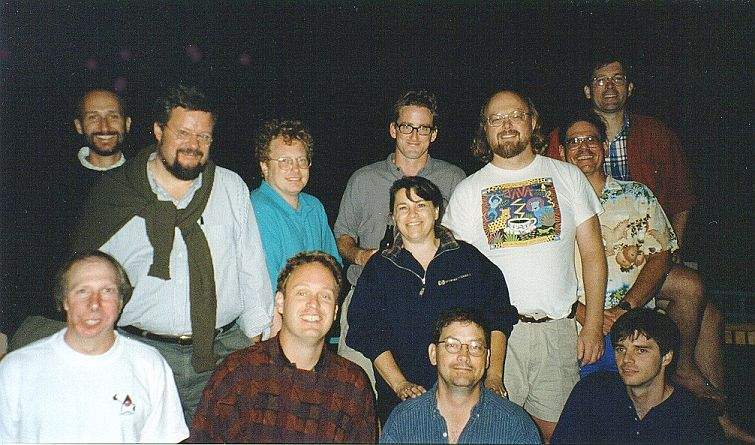
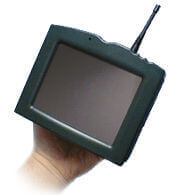

# 📝  Java - Anotações e Exercícios

## 💖 Referências 

<table style="border:none;">
  <tr style="border:none;">
    <td style="border:none;">

- [Curso em Vídeo](https://www.cursoemvideo.com)
- [W3SCHOOLS](https://www.w3schools.com)
- [DOC](https://docs.oracle.com/javase/tutorial/)

    </td>
    <td style="border:none;">
      
    </td>
  </tr>
</table> |

## ⏳ História do  Java

Em 1990, a equipe **"Green Team"** da Sun Microsystems,liderada por James Gosling, tinha o intuito de criar uma tecnologia que fizesse dispositivos diferentes se comunicar entre si.

 A linguagem escolhida para esse feito seria o C++, no entanto eles tiveram dificuldades no desenvolvimento do projeto e a linguagem C++ não foi suficiente. Diante disso, a "Green Team" não viu outra alternativa, a não ser criar sua própria linguagem, **"Green Talk"**.
 
 "Green Talk" foi rebatizado em 1991 para **"Oak"**. Em seguida, eles criaram o ***7(Star Seven)**, uma tela de 6 polegadas com antena, entrada para fone fone de ouvido, uma tela sensível ao toque e outros componentes. A intenção era ter controle sobre outros dispositivos atráves do *7.
 
 
 
 Todavia, sendo bem direta, o dispositivo foi um fracasso e nenhuma empresa quis levar para frente...O projeto foi engavetado. Mas não fiquem triste amores, mais na frente o gostoso do Tim Berners-Lee estava fazendo o HTML e outros tecnologias relacionadas. Eles pensaram em juntar a interatividade do projeto do Oak às tecnologias web e assim surgiu o navegador "Web Runner".
 
 
 Um grande problema surgiu, por direitos autorais... Uma tecnologia chamada "Oak" já existia. Então a equipe de Gosling nomeou a linguagem com uma espécie de café bem forte conhecida como "Java Coffee", no caso somente **"Java"**.
 
 
 O projeto do Web Runner foi nomeado junto também para "Hot Java". Java ficou tão conhecido nessa época, que os copycats da Netscape nomearam o Javascript somente por conta da popularidade do Java. 
 
 
 O robô de um dos projetos da Nasa, se comunicava do espaço para terra atráves da linguagem Java. 
